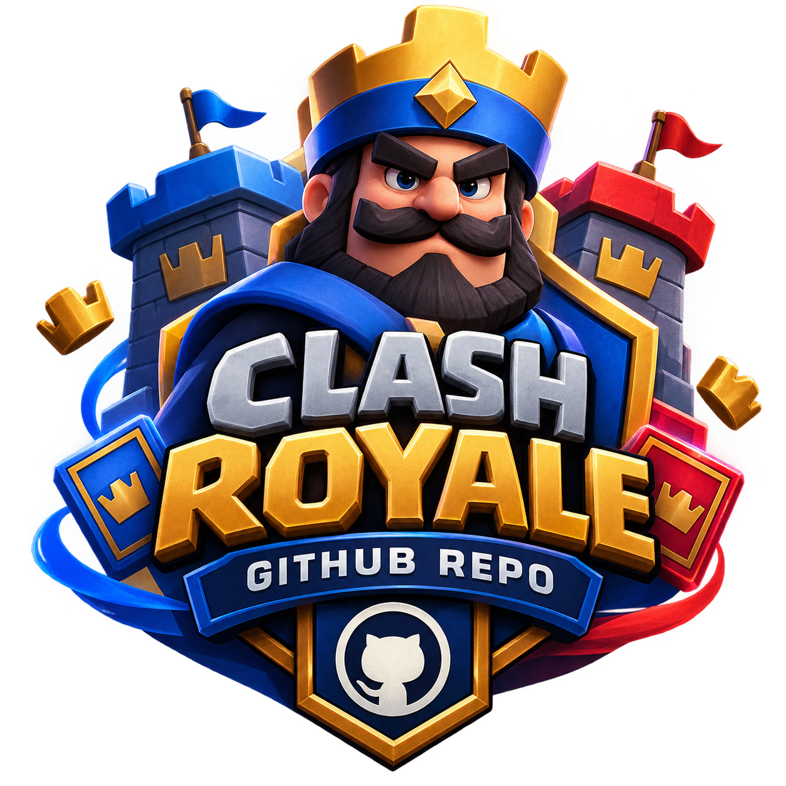

<p align="center">
  
</p>


# Clash Royale Opponent CV Bot

A computer vision project for detecting opponent cards, identifying deck patterns, and predicting the opponent's next move.

## Project Structure

```text
clash-cv-bot/

├── src/
│   ├── config.py             # API configuration and token
│   ├── fetch_cards.py        # Download card dataset from the official API
│   ├── capture_frame.py       # Capture live frames from the emulator using ADB
│   └── card_detector.py       # (Next phase) Card detection using YOLO

├── data/
│   └── cards/                # Card images and metadata are stored here

├── requirements.txt
└── README.md
```

## Step 1: Get an Official API Key

1. Go to https://developer.clashroyale.com and create an account.

2. Create a new API key and **whitelist the public IP address of your server/system**.

   The API is restricted by IP address. If you have a dynamic IP, you may need to update the whitelist whenever your IP changes.

   Alternatively, you can use the RoyaleAPI proxy:

   `https://proxy.royaleapi.dev/v1`

3. Store the token in a `.env` file or directly in `src/config.py`.

   Instructions for configuring the token are provided in the corresponding file.

## Step 2: Install Dependencies

```bash
pip install -r requirements.txt
```

To capture frames from the emulator, you also need ADB:

### Linux / macOS

```bash
sudo apt install adb
```

Or on macOS:

```bash
brew install android-platform-tools
```

Then verify that your emulator is detected:

```bash
adb devices
```

The emulator should appear in the list of connected devices.

## Step 3: Download the Card Dataset

Run:

```bash
python src/fetch_cards.py
```

This script downloads the list of all available cards along with their images and stores them in:

```text
data/cards/
```

This dataset serves as the base dataset for training the card detection model (YOLO).

## Step 4: Test Live Frame Capture

Run:

```bash
python src/capture_frame.py
```

The script captures a screenshot from the emulator and saves it in:

```text
data/frames/
```

This is the first step in building the live computer vision pipeline.

## Step 5: Generate a Synthetic Dataset

Manually annotating thousands of real gameplay frames is extremely time-consuming. Instead, we can automatically place the downloaded card images onto empty arena backgrounds and calculate the bounding boxes automatically.

### 1. Configure the Arena Bounding Box

Set the `ARENA_BBOX` value in:

```text
src/config.py
```

to match the actual coordinates of the arena on your phone/emulator.

Take a screenshot and use an image editor to determine the exact boundaries of the playable arena.

### 2. Collect Empty Arena Backgrounds

Take around **10–20 screenshots** of the empty arena:

* No troops or units
* No cards placed on the battlefield
* Preferably from the beginning of a match

Place these images in:

```text
data/backgrounds/
```

### 3. Generate the Dataset

Run:

```bash
python src/generate_dataset.py --count 3000 --val-split 0.15
```

The generated dataset will be stored in:

```text
data/dataset/
```

in the standard YOLO format, including a `data.yaml` file.

## Step 6: Train the YOLOv8 Model

Install Ultralytics:

```bash
pip install ultralytics
```

Then train the model:

```bash
python src/train_yolo.py --epochs 50
```

The final model weights will be saved at:

```text
runs/detect/clash_royale_card_detector/weights/best.pt
```

> **Note:** Since the dataset is synthetic (real backgrounds + separate card images), the model may perform worse on real gameplay frames due to lighting, visual effects, animations, scaling differences, and other real-world variations.
>
> After this stage, the model should be fine-tuned using a relatively small number of manually labeled real gameplay frames (approximately **200–500 images**) to reduce the gap between the synthetic and real-world data.

## Step 7: Live Card Detection and Match History Logging

Once the model has been trained, it can be used to detect opponent cards in real time:

```bash
python src/card_detector.py --conf 0.5 --fps 3 --show
```

### Options

* `--show` opens a live window displaying bounding boxes around detected cards.
* `--conf 0.5` sets the confidence threshold to 0.5.
* `--fps 3` processes approximately 3 frames per second.

Every detected card sighting is logged to:

```text
data/match_logs/match_<timestamp>.jsonl
```

For example:

```json
{"t": 12.4, "card": "giant", "conf": 0.87, "x": 0.42}
{"t": 18.9, "card": "fireball", "conf": 0.91, "x": 0.55}
```

Where:

* `t` = seconds elapsed since the beginning of the match
* `card` = detected card name
* `conf` = model confidence
* `x` = normalized horizontal position of the card on the arena (`0` = left, `1` = right)

These logs are the raw data that will later be used to train the card sequence prediction model.

## Step 8: Next-Card Prediction Model

This is the core predictive intelligence of the project.

The model uses the match logs collected from:

```text
data/match_logs/*.jsonl
```

and trains an LSTM model to predict the opponent's most likely next card based on their recent card history.

### 1. Convert Raw Logs into Clean Sequences

Because the same card may be detected repeatedly across consecutive frames, the raw sightings first need to be deduplicated:

```bash
python src/prepare_sequences.py
```

### 2. Train the Predictor

Install PyTorch:

```bash
pip install torch
```

Then train the model:

```bash
python src/train_predictor.py --epochs 40
```

### 3. Make a Prediction

For example:

```bash
python src/predict_next_card.py --history knight archers giant --top-k 3
```

This predicts the most likely next cards based on the provided card history.

### Synthetic Test

The prediction pipeline was tested using a strong synthetic pattern.

A hypothetical opponent was simulated over **40 matches**, where the opponent played `fireball` after `giant` approximately **80% of the time**.

After 40 training epochs:

* Training accuracy reached approximately **53%**
* Random guessing with 6 cards would give approximately **17%**
* When asked to predict the next card after `giant`, the model assigned approximately **97.7% probability to `fireball`**

This confirms that the model architecture and prediction pipeline work correctly and are ready to be trained on real gameplay data.

### Files in This Stage

* `prepare_sequences.py` — Deduplicates raw card sightings and converts them into actual card-play events.
* `sequence_model.py` — Defines the LSTM model and card vocabulary shared between training and prediction.
* `train_predictor.py` — Training loop for the prediction model.
* `predict_next_card.py` — Performs next-card prediction and can later be imported into `card_detector.py` for real-time predictions.

> **Note:** Accuracy on real gameplay data will likely be lower than the synthetic test because human behavior is much less deterministic than the artificial pattern used in the experiment.
>
> However, collecting more match logs — especially from the same opponent or account — can improve prediction performance for that specific opponent.

## Roadmap

* [x] Download card dataset from the official API
* [x] Build live frame capture pipeline
* [x] Generate synthetic dataset + training script
* [x] Connect the trained model to the live frame pipeline and record card detection history
* [x] Implement the card sequence prediction model (LSTM) — tested and verified
* [ ] Fine-tune the detection model using manually labeled real gameplay samples
* [ ] Implement OCR to read the opponent's elixir value as an additional prediction signal
* [ ] Integrate `predict_next_card.py` into the live `card_detector.py` loop for real-time next-card prediction
